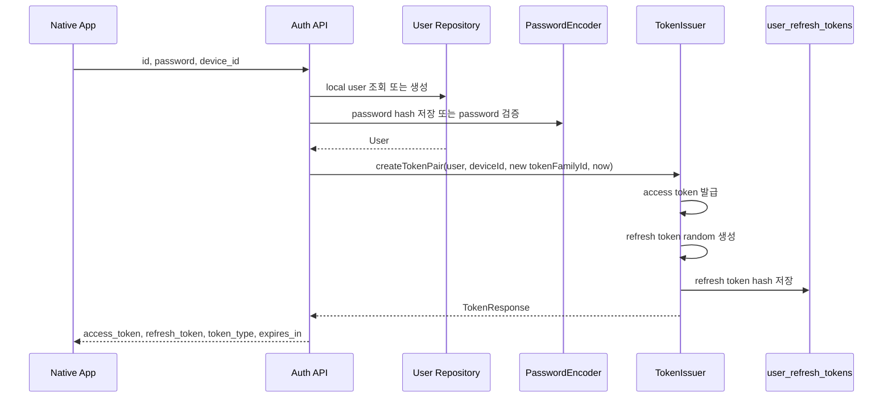
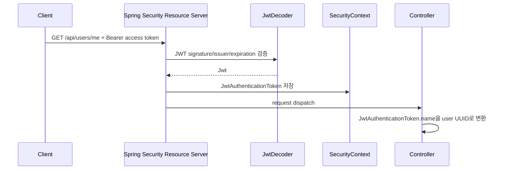
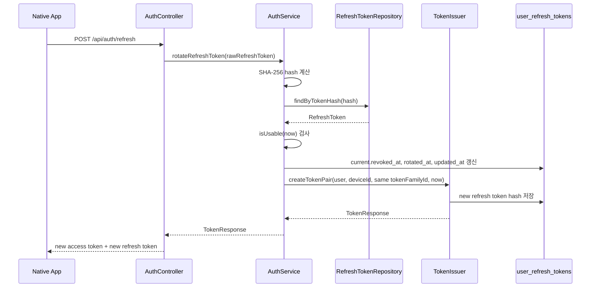
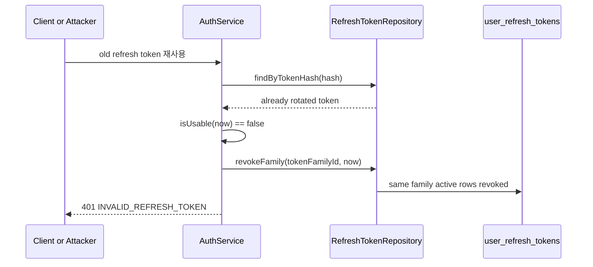
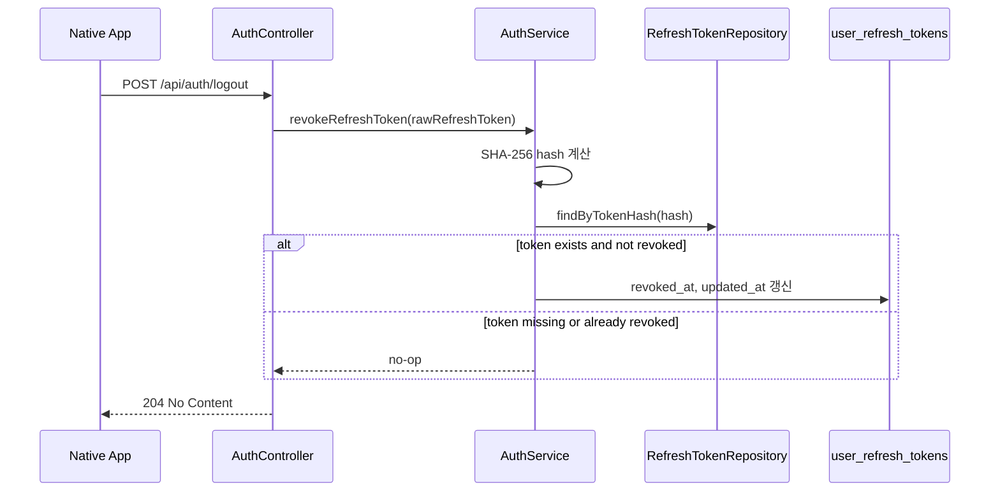

# Auth Flow

이 문서는 TCG Search 백엔드의 인증 흐름을 설명한다. 대상은 현재 코드 기준의
JWT access token, Postgres 기반 refresh token rotation, logout/revoke 동작이다.

## Current Status

현재 구현된 public auth API는 다음 네 개다.

- `POST /api/auth/signup`
- `POST /api/auth/login`
- `POST /api/auth/refresh`
- `POST /api/auth/logout`

회원가입과 로그인은 현재 local `id`/`password` 기반이다. 성공하면
[TokenIssuer](../src/main/kotlin/com/tcgsearch/global/util/TokenIssuer.kt)를 통해 access token과
refresh token을 함께 발급한다.

## Main Components

### SecurityConfig

[SecurityConfig](../src/main/kotlin/com/tcgsearch/global/security/SecurityConfig.kt)는
Spring Security filter chain과 JWT 인코더/디코더를 구성한다.

- session은 `STATELESS`다.
- CSRF, form login, HTTP basic, server-side logout은 비활성화되어 있다.
- `/api/auth/signup`, `/api/auth/login`, `/api/auth/refresh`, `/api/auth/logout`,
  actuator health/info, Swagger endpoint는 public이다.
- `/api/**`는 인증이 필요하다.
- access token 검증은 `oauth2ResourceServer { jwt { } }`가 처리한다.
- `JwtEncoder`와 `JwtDecoder`는 같은 HMAC secret을 사용한다.
- 현재 `app.auth.jwt.secret`은 base64 encoded secret이어야 한다.

### TokenIssuer

[TokenIssuer](../src/main/kotlin/com/tcgsearch/global/util/TokenIssuer.kt)는 토큰 발급 전용
컴포넌트다.

- access token은 Spring Security `JwtEncoder`로 발급한다.
- refresh token은 32 bytes random 값을 URL-safe base64 문자열로 만든다.
- refresh token 원문은 클라이언트에게만 반환한다.
- 서버 DB에는 refresh token 원문 대신 SHA-256 hash만 저장한다.

### AuthController

[AuthController](../src/main/kotlin/com/tcgsearch/domain/auth/controller/AuthController.kt)는 auth API를
HTTP로 노출한다.

- `POST /api/auth/signup`은 local 사용자를 만들고 새 토큰 쌍을 반환한다.
- `POST /api/auth/login`은 local credential을 검증하고 새 토큰 쌍을 반환한다.
- `POST /api/auth/refresh`는 refresh token을 회전하고 새 토큰 쌍을 반환한다.
- `POST /api/auth/logout`은 refresh token을 revoke하고 `204 No Content`를 반환한다.

### AuthService

[AuthServiceImpl](../src/main/kotlin/com/tcgsearch/domain/auth/service/AuthServiceImpl.kt)는
local credential 인증, refresh token rotation, revoke 정책을 소유한다.

- signup은 중복 local id를 거부하고 `password_hash`만 저장한다.
- login은 id/password를 검증하고 실패 시 `INVALID_LOGIN_CREDENTIALS`로 통일한다.
- rotation은 `REPEATABLE_READ` transaction으로 실행한다.
- refresh token을 hash로 조회한다.
- token이 재사용/만료/revoke 상태면 같은 token family 전체를 revoke한다.
- token이 정상 사용 가능하면 기존 token을 revoke + rotated 처리하고 새 토큰 쌍을 발급한다.

### RefreshToken Entity

[RefreshToken](../src/main/kotlin/com/tcgsearch/domain/auth/entity/RefreshToken.kt)은
`user_refresh_tokens` 테이블에 저장된다.

핵심 컬럼은 다음과 같다.

- `user_id`: refresh token 소유 사용자
- `device_id`: refresh token이 묶인 클라이언트 장치 식별자
- `token_hash`: refresh token 원문의 SHA-256 hash
- `token_family_id`: rotation family 식별자
- `expires_at`: refresh token 만료 시각
- `revoked_at`: revoke 시각
- `rotated_at`: rotation으로 교체된 시각
- `last_used_at`: 컬럼은 있지만 현재 service에서는 갱신하지 않는다.

`RefreshToken.isUsable(now)`는 다음 세 조건을 모두 만족할 때만 true다.

- `revoked_at is null`
- `rotated_at is null`
- `expires_at > now`

## Token Model

### Access Token

Access token은 stateless JWT다.

현재 claim은 다음을 포함한다.

- `iss`: `app.auth.jwt.issuer`
- `iat`: 발급 시각
- `exp`: 만료 시각
- `sub`: 사용자 UUID
- `email`: 사용자 email
- `role`: 사용자 role

Access token은 DB에 저장하지 않는다. 서버는 요청마다 JWT signature, issuer, expiration을
검증하고 유효하면 SecurityContext에 인증 정보를 만든다. Access token을 즉시 폐기하는
목록은 현재 없다. access token 만료 전 강제 차단이 필요하면 별도 blacklist나 token
version 전략이 필요하다.

### Refresh Token

Refresh token은 opaque random token이다. 서버는 refresh token의 의미를 토큰 자체에서
읽지 않고 DB row로 판단한다.

클라이언트가 보관하는 값:

- 원문 refresh token

서버가 저장하는 값:

- refresh token hash
- user
- device id
- token family id
- expiration/revocation/rotation timestamp

이 구조의 목적은 다음과 같다.

- DB가 유출되어도 원문 refresh token을 바로 사용할 수 없게 한다.
- refresh token이 재사용되면 같은 family를 모두 revoke해 탈취 가능성을 차단한다.
- native app에서 access token 만료 후 refresh token으로 새 access token을 받을 수 있게 한다.

## Login Flow

`POST /api/auth/signup`

Request:

```json
{
  "id": "collector01",
  "password": "password123!",
  "device_id": "ios-primary"
}
```

`id`는 현재 local provider의 `provider_subject`로 저장된다. 기존 `app_users.email` 컬럼이
필수라서 지금은 같은 값을 `email`에도 저장한다. 비밀번호 원문은 저장하지 않고
`password_hash`만 저장한다.

회원가입 ID는 4~20자의 영문 소문자, 숫자, `.`, `_`만 허용한다. 영문 또는 숫자로 시작하고
끝나야 하며, `.`, `_`가 연속으로 올 수 없다.

회원가입 password는 8~72자이고 영문, 숫자, 특수문자를 각각 최소 1개 포함해야 한다.
공백은 허용하지 않는다. 이 정책은 신규 가입에만 적용하며, login 요청에는 credential
검증 실패를 구분하지 않기 위해 `NotBlank` 중심의 기본 validation만 적용한다.

`POST /api/auth/login`

Request:

```json
{
  "id": "collector01",
  "password": "password123!",
  "device_id": "ios-primary"
}
```

signup과 login의 성공 응답은 모두 `TokenResponse`다.



로그인 성공 시 새 `token_family_id`를 만든다. 같은 장치의 기존 refresh token을 어떻게
처리할지는 로그인 정책에서 결정해야 한다. 예를 들어 한 장치에 한 세션만 허용하려면
로그인 전에 같은 `user_id + device_id`의 active token을 revoke하는 정책을 추가한다.

## Authenticated Request Flow

인증이 필요한 API 요청은 `Authorization: Bearer <access_token>` 헤더를 사용한다.



현재 [UserController](../src/main/kotlin/com/tcgsearch/domain/user/controller/UserController.kt)는
`JwtAuthenticationToken.name`을 사용자 UUID로 변환해 `UserService.getCurrentUser(...)`에 넘긴다.

## Refresh Rotate Flow

`POST /api/auth/refresh`

Request:

```json
{
  "refresh_token": "client-refresh-token"
}
```

Response:

```json
{
  "access_token": "new-access-token",
  "refresh_token": "new-refresh-token",
  "token_type": "Bearer",
  "expires_in": 900
}
```

동작 순서는 다음과 같다.



중요한 점은 refresh token rotation이 “기존 token을 그대로 연장”하지 않는다는 것이다.
항상 기존 refresh token은 `revoked_at`과 `rotated_at`이 채워지고, 새 refresh token row가
생긴다. 새 row는 기존 row와 같은 `token_family_id`를 공유한다.

## Refresh Reuse Detection

이미 rotate된 refresh token이 다시 들어오면 탈취 또는 중복 사용 가능성이 있다.

현재 정책은 다음과 같다.

1. refresh token hash로 row를 찾는다.
2. row가 있지만 `isUsable(now)`가 false면 비정상 사용으로 본다.
3. 같은 `token_family_id`의 active refresh token을 모두 revoke한다.
4. `INVALID_REFRESH_TOKEN`을 던진다.



[CustomRefreshTokenRepositoryImpl](../src/main/kotlin/com/tcgsearch/domain/auth/repository/CustomRefreshTokenRepositoryImpl.kt)는
QueryDSL bulk update로 `token_family_id`가 같고 `revoked_at is null`인 row의
`revoked_at`, `updated_at`을 한번에 갱신한다. update 전에 `entityManager.flush()`를
호출하고, update 후 `entityManager.clear()`로 persistence context와 DB 상태 차이를 줄인다.

## Logout And Revoke Flow

`POST /api/auth/logout`

Request:

```json
{
  "refresh_token": "client-refresh-token"
}
```

Response:

```text
204 No Content
```

현재 logout은 access token이 아니라 refresh token 소유를 기준으로 처리한다. Security
설정에서도 `/api/auth/logout`은 public endpoint다. 즉, access token이 만료된 상태에서도
클라이언트가 refresh token을 제출하면 logout할 수 있다.

동작 순서는 다음과 같다.



Logout은 idempotent에 가깝게 동작한다. 알 수 없는 refresh token이 들어오면 예외를 던지지
않고 그대로 반환한다. 이미 revoke된 token도 추가 변경 없이 통과한다.

## Error Cases

### Refresh Token Not Found

`POST /api/auth/refresh`에서 hash로 row를 찾지 못하면 `INVALID_REFRESH_TOKEN`이다.
현재 응답 status는 `401 Unauthorized`다.

### Refresh Token Expired, Revoked, Or Rotated

row가 있어도 `revoked_at`, `rotated_at`, `expires_at` 조건 중 하나라도 실패하면 usable하지
않다. 이 경우 같은 token family를 revoke하고 `401 INVALID_REFRESH_TOKEN`을 반환한다.

### Access Token Invalid

인증이 필요한 `/api/**` 요청에서 access token이 없거나 invalid이면 Spring Security
Resource Server가 요청을 거부한다. 현재 `AuthenticationEntryPoint`는 body 없이
`401 Unauthorized` status를 내려준다.

### User Not Found

JWT subject가 UUID이지만 DB에 해당 user가 없으면 `UserService`에서 `USER_NOT_FOUND`를
던진다. 현재 status는 `404 Not Found`다.

## Security Notes

- Password 원문은 DB에 저장하지 않는다.
- Local password는 Spring Security `PasswordEncoder`로 hash한 값만 `password_hash`에 저장한다.
- Refresh token 원문은 DB에 저장하지 않는다.
- Refresh token hash는 unique하다.
- Rotation 성공 시 기존 refresh token은 즉시 재사용 불가능해진다.
- Reuse가 감지되면 같은 family 전체를 revoke한다.
- Access token은 짧은 TTL을 전제로 한다. 현재 기본값은 `15m`다.
- Refresh token TTL은 `app.auth.refresh-token.ttl`이고 현재 기본값은 `30d`다.
- `app.auth.jwt.secret`은 현재 base64 encoded HMAC secret이어야 한다.
- HS256 기준 secret material은 최소 32 bytes 이상이어야 한다.

## Login API Follow-Up Checklist

현재 local signup/login은 구현되어 있다. 다음 항목은 정책을 확장할 때 결정한다.

- 같은 사용자/장치의 기존 active refresh token을 유지할지 revoke할지
- access token claim에 추가할 값이 있는지
- email/display name을 local id와 분리할지
- OAuth provider, Apple, Google login을 추가할지
- ID/password 정책을 더 엄격히 할지

## References In Code

- [SecurityConfig](../src/main/kotlin/com/tcgsearch/global/security/SecurityConfig.kt)
- [TokenIssuer](../src/main/kotlin/com/tcgsearch/global/util/TokenIssuer.kt)
- [AuthController](../src/main/kotlin/com/tcgsearch/domain/auth/controller/AuthController.kt)
- [AuthServiceImpl](../src/main/kotlin/com/tcgsearch/domain/auth/service/AuthServiceImpl.kt)
- [RefreshToken](../src/main/kotlin/com/tcgsearch/domain/auth/entity/RefreshToken.kt)
- [RefreshTokenRepository](../src/main/kotlin/com/tcgsearch/domain/auth/repository/RefreshTokenRepository.kt)
- [CustomRefreshTokenRepositoryImpl](../src/main/kotlin/com/tcgsearch/domain/auth/repository/CustomRefreshTokenRepositoryImpl.kt)
