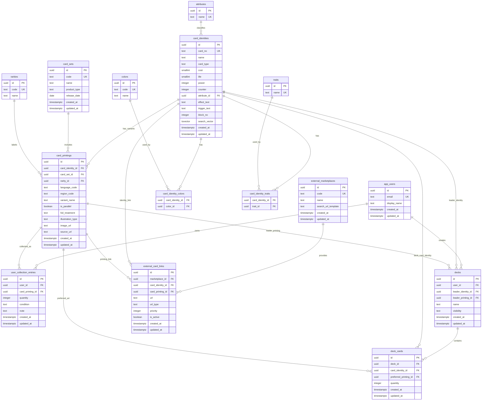

# One Piece Card Search Database Design

## Context

This project starts from an empty repository. The first backend target is a Kotlin + Spring Boot API backed by PostgreSQL. The product scope is:

- Card encyclopedia and search
- User collection tracking
- Deck builder
- SNKR DUNK outbound sales links

The database design uses PostgreSQL and keeps the first implementation focused on data the app owns. It does not model external marketplace prices, inventory, purchases, or orders yet.

## Current Framework Direction

As of June 16, 2026, the official Spring documentation presents Spring Boot 4.1.0 as the current stable line. The backend setup should use:

- Kotlin
- Spring Boot 4.1.x
- Gradle Kotlin DSL
- Java 25 Gradle toolchain by default. Spring Boot 4.1 requires at least Java 17 and supports up to Java 26, so Java 25 is the intended modern baseline for this project.
- Spring Web MVC
- Spring Validation
- Spring Data JPA with Hibernate
- PostgreSQL JDBC driver
- Flyway for schema migrations
- Spring Boot Actuator
- Docker Compose development services for local PostgreSQL
- Testcontainers for integration tests

Spring Boot Kotlin support requires Kotlin 2.2.x or newer and expects `kotlin-reflect`, `kotlin-stdlib`, Jackson Kotlin support, and the `kotlin-spring` compiler plugin.

## Core Modeling Decision

Separate the game identity of a card from its physical or display printing.

- `card_identities` represents the game-level card such as `OP01-001`. This is the unit used for search, detail pages, card rules, and deck legality.
- `card_printings` represents collectible/display variants such as base art, SEC, parallel, language, region, image, foil treatment, set reprint, or alternate illustration.

This supports the required behavior: a user can search individual results, open an `OP01-001` detail page, and see related `OP01-001` variants such as SEC, parallel, different language printings, and reprints.

## ERD



## Table Responsibilities

### Catalog

- `card_identities`: canonical game-level card record. It stores card number, name, type, cost/life/power/counter fields, attribute, effect text, trigger text, block number, and search vector.
- `card_printings`: display and collection-level record. It stores set, rarity, language, region, parallel flag, foil treatment, illustration type, image URL, and source URL.
- `card_sets`: official product or set such as booster, starter deck, premium booster, or promotion grouping.
- `colors`: canonical colors such as red, green, blue, purple, black, yellow, and multicolor support through the join table.
- `traits`: normalized slash-separated card traits such as `Whitebeard Pirates` or `Land of Wano`.
- `attributes`: normalized combat attributes such as slash, strike, ranged, special, and wisdom.
- `rarities`: rarity codes such as C, UC, R, SR, SEC, L, and promotional variants.

### Collection

- `user_collection_entries`: user-owned quantities are tracked at the `card_printing` level because collection state depends on the actual printing. It can later be extended with condition, acquisition price, grading, storage location, or trade status.

### Deck Builder

- `decks`: owned by a user and anchored to a leader `card_identity`. The optional `leader_printing_id` controls display art.
- `deck_cards`: stores deck quantities by `card_identity` for rule validation. The optional `preferred_printing_id` lets a user choose a specific art or printing without changing deck legality.

### External Links

- `external_marketplaces`: stores marketplace metadata and a search URL template. Initial seed is SNKR DUNK.
- `external_card_links`: stores manually curated marketplace URLs. If an active manual URL exists, use it. Otherwise generate a fallback search URL from the marketplace template using card number and localized card name.

## SNKR DUNK Link Rule

For a card detail page:

1. Look for an active `external_card_links` row for SNKR DUNK on the selected `card_printing_id`.
2. If not found, look for an active row for the `card_identity_id`.
3. If not found, generate a search URL from `external_marketplaces.search_url_template` using a query like `OP01-001 Monkey.D.Luffy`.

The first implementation should not scrape SNKR DUNK. Price and availability snapshots can be added later if data access is reliable and permitted.

## Search And Grouping Behavior

Search can return either identities or printings depending on the UI:

- General search should primarily rank `card_identities` using `card_no`, `name`, effect text, traits, card type, colors, and set metadata.
- Printing-specific search can return `card_printings` when the query includes rarity, parallel, language, or set terms.
- Detail pages load one `card_identity` and then show grouped `card_printings` for variant recommendations.

Recommended PostgreSQL indexes:

- `unique index on card_identities(card_no)`
- `gin index on card_identities(search_vector)`
- `index on card_printings(card_identity_id)`
- `index on card_printings(card_set_id)`
- `index on card_printings(rarity_id)`
- `unique index on card_identity_colors(card_identity_id, color_id)`
- `unique index on card_identity_traits(card_identity_id, trait_id)`
- `unique index on user_collection_entries(user_id, card_printing_id, condition)`
- `unique index on deck_cards(deck_id, card_identity_id)`
- `index on external_card_links(marketplace_id, card_identity_id)`
- `index on external_card_links(marketplace_id, card_printing_id)`

## Initial Backend Shape

Use package-by-feature boundaries:

```text
com.tcgsearch
  catalog
    domain
    persistence
    api
  collection
    domain
    persistence
    api
  deck
    domain
    persistence
    api
  marketplace
    domain
    persistence
    api
  common
```

The initial API surface should stay narrow:

- `GET /api/cards`: card search
- `GET /api/cards/{cardNo}`: identity detail plus grouped printings
- `GET /api/cards/{cardNo}/marketplace-links`: manual or generated SNKR DUNK links
- `GET /api/decks`, `POST /api/decks`: deck list and creation
- `PUT /api/decks/{deckId}/cards`: replace deck card quantities
- `GET /api/collection`, `PUT /api/collection/{printingId}`: collection read and quantity update

Authentication can be stubbed behind a fixed development user until the product chooses an auth provider.

## Error Handling

- Return validation errors as `400` with field-level messages.
- Return missing cards, printings, decks, and collection entries as `404`.
- Return illegal deck edits as `422` once rule validation is implemented.
- Keep external marketplace link generation local and deterministic, so SNKR DUNK downtime does not break card detail views.

## Testing

- Unit test marketplace fallback URL generation.
- Unit test deck quantity validation when implemented.
- Repository/integration tests should use Testcontainers with PostgreSQL.
- Migration verification should run through Flyway during application startup tests.
- API tests should cover search, card detail grouping, collection quantity update, and deck card replacement.

## Out Of Scope For First Backend Setup

- SNKR DUNK scraping
- Price and inventory snapshots
- Purchase or affiliate tracking
- Full auth provider integration
- Admin UI for card imports
- Sophisticated deck legality beyond basic card count and leader-color constraints
